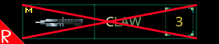

# Quasimorph Remove Project Command



A command to free up a weapon or armor upgrade project.

# Version .8+ Update:
This mod is no longer needed.
Version .8+ now supports removing weapon projects.  Reverse the attribute upgrades until the project shows 0/X upgrades.  Then  start the research.  
After this "undo" project is finished, the weapon project slot will be made available again.

# Automatic Backup
Before the command modifies a save slot, a backup zip file for the target save files will be created in the game's user folder.

Example: 
```%AppData%\..\LocalLow\Magnum Scriptum Ltd\Quasimorph_ModConfigs\slot_2_20240730_171029_698.zip```

The file name is created with a date based suffix.

To undo the changes, quit the game or go back to the main menu.  Unzip the backup file to the folder, overwriting the ```slot_<number>_*``` files.  Do not extract to a sub folder.  
 
# Usage
Example command: ```remove-project 2 army_knife```

Requires the Developer Console https://steamcommunity.com/sharedfiles/filedetails/?id=3281579458 .

This command is only available at the main menu.

At the main menu, open the command console (`).

Type ```remove-project```, space, the save's slot number (0-2), then the tab key.  
The command will list all of the projects in the save that can be removed.
Note that the slot numbers start at zero, so valid values are 0-2.

If there is more than one project, use the up and down arrows to select the line the with target project. If there is only one project, the command line will already have the project entered.  Press enter.  


# Effects
The command will remove the project from the Magnum and replace every modified version with the base version.
Due to how the game stores an item's durability, items with durability increases will not be rolled back to the base value.

Any affected items can be deleted at inventory screens if desired.

# Support
If you enjoy my mods and want to buy me a coffee, check out my [Ko-Fi](https://ko-fi.com/nbkredspy71915) page.
Thanks!

# Source Code
Source code is available on GitHub at https://github.com/NBKRedSpy/QM_RemoveProjectCommand

